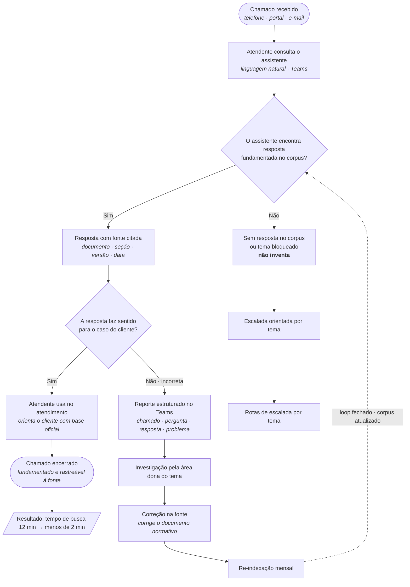

# Jornada do Atendente — Assistente de IA

**Discovery · NovaTech × DB1 — Etapa 4**
Assistente de IA com resposta fundamentada na documentação, fallback orientado por tema e loop de correção na fonte.

| | |
|---|---|
| **Cliente** | NovaTech (logística, 1.200 funcionários) |
| **Solução** | Assistente de IA (RAG) integrado ao Microsoft Teams + SharePoint |
| **Resultado esperado** | Tempo de busca por chamado: **12 min → < 2 min** |
| **Volume** | 320 chamados/dia · ~60% consultam documentação |

---

## Diagrama do fluxo

---

## Caminho principal

1. **Chamado recebido** — telefone, portal ou e-mail.
2. **Atendente consulta o assistente** — pergunta em linguagem natural dentro do Microsoft Teams.
3. **Decisão:** o assistente encontra resposta fundamentada no corpus?
   - **Sim →** segue para a resposta.
   - **Não →** segue para o fluxo de *Fallback*.
4. **Resposta com fonte citada** — documento, seção, versão e data.
   `PROC-042-v2 · seção 2 · vig. 01/12/2023`
5. **Decisão:** a resposta faz sentido para o caso do cliente?
   - **Sim →** atendente usa no atendimento.
   - **Não / incorreta →** segue para o *Loop de correção*.
6. **Atendente usa no atendimento** — orienta o cliente com base oficial.
7. **Chamado encerrado** — fundamentado e rastreável à fonte.

---

## Fallback · escalada orientada

Quando **não há resposta no corpus** ou o **tema é bloqueado**, o assistente sinaliza o limite e **não inventa**. A escalada é orientada por tema:

| Tema | Rota de escalada |
|---|---|
| Carga perigosa > 500 kg | Ramal 4500 · Gestão de Riscos |
| Frete reverso · seguro de carga | Comercial |
| Carga danificada em trânsito | sinistros@novatech.com.br |
| Exceções à política de devolução | Supervisor de atendimento |

---

## Feedback · loop de correção

Quando a resposta está **incorreta ou não faz sentido**, dispara-se um loop que corrige a origem do problema:

1. **Reporte estruturado no Teams** — chamado · pergunta · resposta · problema identificado.
2. **Investigação pela área dona do tema.**
3. **Correção na fonte** — corrige o **documento normativo**, não apenas a resposta pontual.
4. **Re-indexação mensal** — o corpus atualizado realimenta o assistente (*loop fechado*).

---

## Guardrails (ativos em todos os fluxos)

Restrições que valem para **qualquer** pergunta:

- **G1 — Nunca informar prazo ou valor sem fonte que o sustente.** Não estima, não calcula de cabeça.
- **G2 — Nunca responder sobre devolução com base no FAQ.** Apenas POL / PROC / SLA — ou escala.
- **G3 — Sempre distinguir devolução de orientação.** Fluxos, prazos e canais distintos.
- **G4 — Nunca confirmar desconto ou exceção.** PROC-042 v2 · limiar de alçada.
